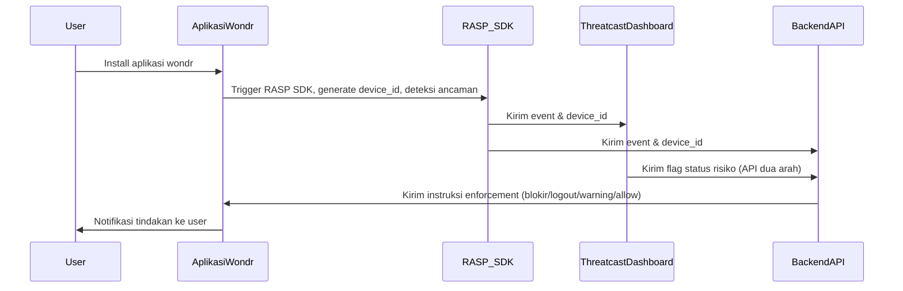

# Rekomendasi Arsitektur Keamanan Mobile wondr By BNI

**Integrasi Dua Arah Threatcast dengan Enforcement Otomatis**

---

## 📄 Ringkasan Eksekutif

Aplikasi mobile wondr by BNI menghadapi tantangan besar pada keamanan perangkat, khususnya di ekosistem Android. Berbagai teknik bypass root, modifikasi perangkat, dan custom ROM dapat meningkatkan risiko fraud. Saat ini, solusi monitoring seperti Guardsquare Threatcast masih bersifat satu arah—aplikasi hanya mengirim event ke Threatcast, tanpa ada umpan balik otomatis ke backend aplikasi.
Dokumen ini merekomendasikan arsitektur keamanan dua arah, di mana aplikasi, RASP, backend, dan Threatcast saling terhubung dan mampu menanggulangi ancaman secara otomatis, persisten, dan auditable.

---

## 🔎 Latar Belakang & Permasalahan

### **Permasalahan yang Ditemukan**

* **Monitoring Satu Arah (One-Way Monitoring):**
  Aplikasi hanya mengirim data perangkat dan event keamanan ke RASP/Threatcast untuk monitoring. Tidak ada tindakan aktif atau intervensi otomatis dari backend, kecuali kasus khusus (root/Magisk).

* **Flag Risiko Tidak Persisten dan Tidak Konsisten:**
  Ancaman seperti custom ROM, kernel tidak resmi, atau firmware termodifikasi hanya tercatat di Threatcast tanpa penandaan status perangkat di backend aplikasi secara permanen.
  Untuk perangkat dengan Magisk (root), aplikasi langsung crash, namun untuk custom ROM, aplikasi tetap berjalan tanpa enforcement otomatis.

* **Tidak Ada Feedback Loop Otomatis:**
  Enforcement otomatis dari backend hanya dapat terjadi jika ada integrasi API dua arah dengan Threatcast. Saat ini, backend hanya bisa melakukan blokir/aksi setelah pengecekan manual di Threatcast.

---

## 🎯 Tujuan & Sasaran

* Menciptakan pengelolaan risiko perangkat/pengguna yang otomatis dan persisten pada setiap sesi aplikasi.
* Menjamin setiap event keamanan dapat memicu remediasi secara real-time, otomatis, dan tercatat untuk audit serta compliance.
* Memastikan edukasi dan transparansi kepada pengguna yang terkena enforcement.

---

## 🏛️ Rekomendasi Arsitektur Keamanan

### **Komponen Utama**

* **Aplikasi Mobile wondr**

  * Integrasi RASP SDK (Guardsquare) untuk deteksi root, custom ROM, emulator, firmware tidak asli.
  * Attestation perangkat (Play Integrity API).
  * Komunikasi API aman (TLS, certificate pinning).
  * Menerima instruksi keamanan dari backend (blokir, force logout, notifikasi).
  * Notifikasi real-time (FCM/APNS).
  * Edukasi user: Pesan blokir/log out jelas, disertai petunjuk solusi.

* **Backend API**

  * Menerima event keamanan dari aplikasi/RASP.
  * Menyimpan status risiko perangkat/user di database (`device_id`, `user_id`, `risk_status`, `flag_reason`, `updated_at`).
  * Enforcement otomatis sesuai Risk Acceptance Criteria (RAC).
  * Endpoint API untuk sinkronisasi flag risiko dengan Threatcast (dua arah; *saat ini dalam perencanaan/roadmap*).
  * Audit trail seluruh aksi dan update status, minimal disimpan selama 6 bulan untuk keperluan investigasi/regulator.

* **Threatcast (Guardsquare)**

  * Pusat event keamanan, audit log, dan analitik perangkat.
  * API dua arah (ke depan/roadmap) untuk mengirimkan status flag ke backend wondr.
  * Dashboard monitoring dan investigasi manual oleh tim IT Risk/Security.

---

### **Catatan Device\_ID/UUID**

> **Device\_id/UUID yang digunakan di wondr dan Threatcast identik, namun terbentuk pada saat instalasi aplikasi (application-scoped), bukan berbasis hardware. Jika user melakukan reinstall aplikasi, device\_id baru akan terbentuk sehingga tracking risiko tidak persisten terhadap perangkat fisik yang sama.**

---

## 🔗 Alur Kerja Sistem (Flow & Diagram)

### **Narasi Alur**

1. **User install aplikasi wondr**; proses instalasi men-trigger RASP SDK (Guardsquare).
2. **RASP SDK mendeteksi event ancaman** (root, custom ROM, dsb.).
3. **Event RASP otomatis dikirim ke Threatcast Dashboard** sebagai pusat monitoring.
4. **(Ideal, future-proof): Threatcast mengirimkan flag status risiko** (device\_id/UUID flagged) ke backend wondr melalui API dua arah.
5. **Backend memproses flag device\_id/UUID**, mencocokkan dengan database:

   * Jika device\_id/UUID terflag, backend **melakukan blokir, force logout, atau limitasi fitur**.
   * User mendapatkan notifikasi real-time, disertai edukasi dan petunjuk jika devicenya terblokir.

---

## Mermaid Sequence Diagram – Disesuaikan

## ⚠️ Keterbatasan & Implikasi

* **Device\_id Tidak Persisten Hardware:**
  Tidak dapat melakukan tracking risiko secara akurat jika user reinstall aplikasi, karena device\_id baru akan terbentuk.

* **Enforcement Manual (Jika API dua arah belum diterapkan):**
  Backend hanya bisa melakukan blokir/aksi setelah pengecekan manual di Threatcast.

* **Audit Trail Terbatas:**
  Histori status risiko perangkat tidak selalu tersedia di backend kecuali sudah terintegrasi penuh.

* **Edukasi User Penting:**
  Pastikan pesan blokir atau force logout dilengkapi edukasi dan petunjuk bagi user, untuk menghindari kebingungan atau false report ke CS.

---

## 🚀 Manfaat Arsitektur (Jika Integrasi 2 Arah Diterapkan)

* **Enforcement Otomatis:**
  Risiko perangkat dapat langsung diblokir/ditindak tanpa menunggu pengecekan manual.
* **Status Risiko Persisten & Dapat Diaudit:**
  Semua status risiko dan enforcement tercatat di backend.
* **Respon Real-Time:**
  Ancaman langsung mendapat respon tanpa delay manual.
* **Pengelolaan Keamanan Terpusat:**
  Threatcast dan backend saling terintegrasi sebagai command center aktif.

---

## 📚 Rekomendasi & Langkah Lanjut

1. **Bangun integrasi API dua arah** antara Threatcast dan backend wondr, sehingga flag risiko dapat langsung diterima backend.
2. **Evaluasi opsi pembentukan device\_id** berbasis hardware signature (bila privacy dan regulasi memungkinkan), agar risk tracking lebih persisten.
3. **Perkuat audit trail dan compliance** dengan menyimpan histori status risiko di backend minimal 6 bulan.
4. **Sosialisasi keterbatasan** terkait device\_id pada tim audit dan compliance, agar investigasi manual dapat mempertimbangkan aspek ini.
5. **Sediakan template edukasi user** yang jelas apabila device mereka terkena blokir/enforcement.

---

**Referensi:**

* [Guardsquare Threatcast Documentation](https://www.guardsquare.com/products/threatcast)
* [OWASP Mobile Security Testing Guide](https://owasp.org/www-project-mobile-security-testing-guide/)
* [Google Play Integrity API](https://developer.android.com/google/play/integrity)
* [ISO/IEC 27001:2013 – Information Security Management](https://www.iso.org/isoiec-27001-information-security.html)

---

**Pustaka:**

* [Formulasi Risk Acceptance Criteria](rac_top_20.md)
* 
