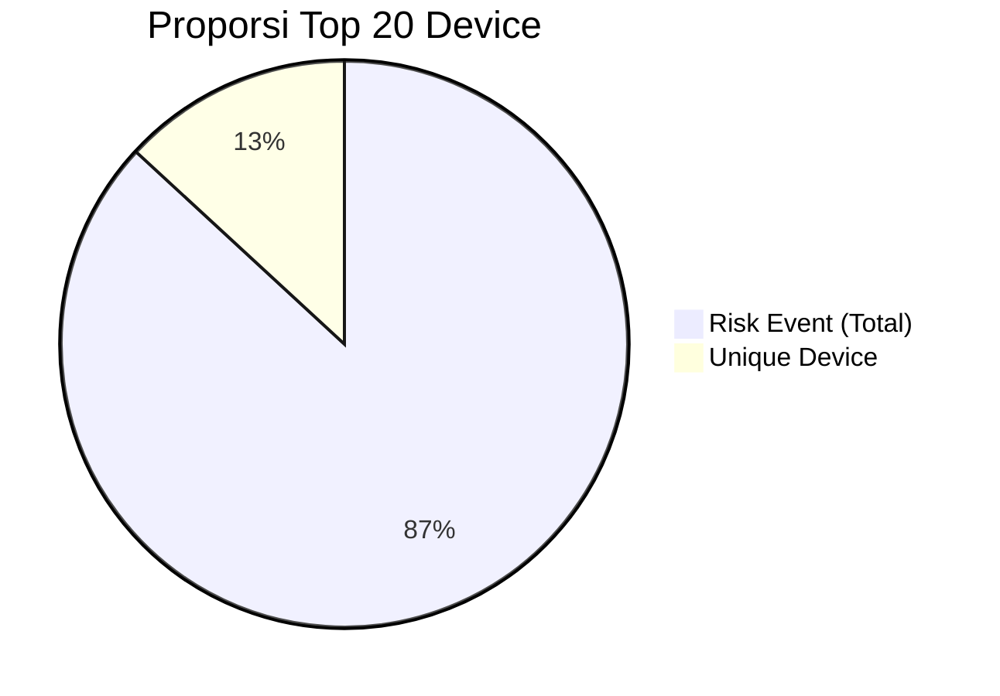

### **1. 32.347 = Jumlah Total Risk Event pada Top 20 Device**

* **32.347** adalah **jumlah seluruh kejadian risk event** (semua flag yang terdeteksi, baik pada device yang sama berulang kali maupun pada device berbeda) yang tercatat pada **20 model device teratas** selama periode monitoring.
* **Cara menghitung:**
  Jumlahkan kolom **Grand Total** pada tabel Top 20 device.
  Nilai Grand Total ini mewakili **jumlah risk event** yang terjadi pada tiap device, termasuk jika satu device terdeteksi beberapa kali di hari yang berbeda atau dalam kondisi flag berbeda.

---

### **2. 4.890 = Jumlah Unique Device (Unique Identifier) pada Top 20 Device**

* **4.890** adalah **jumlah perangkat unik** (unique device ID/app\_user\_id) pada Top 20 model device yang **pernah terdeteksi risk** selama periode monitoring.
* Satu device bisa muncul berkali-kali sebagai risk event (misal: root tetap, device login ulang, flag di hari berbeda), namun **hanya dihitung sekali dalam data unique device**.

---

### **Perbedaan Utama:**

* **32.347** = **Total risk event** (bisa lebih dari satu event pada device yang sama, akumulasi semua kasus/event/flag)
* **4.890** = **Unique device** (hanya menghitung satu kali setiap perangkat, walaupun muncul berkali-kali di event risk)

---

#### **Contoh:**

* Jika **Device A** terdeteksi risk pada 5 hari berbeda, akan dihitung **5 kali** pada Grand Total risk event (**32.347**).
* Namun pada perhitungan unique device, **Device A** tetap hanya dihitung **1 kali** dalam total unique device (**4.890**).

---

### **Kesimpulan:**

* **Angka 32.347** menggambarkan **frekuensi terjadinya ancaman risk** di Top 20 device (banyaknya “kejadian”/event).
* **Angka 4.890** menggambarkan **jumlah perangkat unik yang berisiko** di Top 20 device (banyaknya “identitas device”).

Keduanya sama-sama penting:

* **Event-based** (32.347) untuk melihat beban/pola ancaman (seringnya terjadi).
* **Unique device** (4.890) untuk strategi mitigasi yang efektif (berapa device harus benar-benar diblokir).

---

### **Tabel Perbandingan Risk Event vs Unique Device (Top 20 Device)**

| No  | Model Device       | Total Risk Event (Grand Total) | Unique Device (Unique ID) |
| --- | ------------------ | ------------------------------ | ------------------------- |
| 1   | Vivo vivo 1906     | 4.512                          | (misal) 700               |
| 2   | Infinix HOT 9 Play | 4.386                          | (misal) 690               |
| 3   | Infinix HOT 10     | 3.185                          | (misal) 500               |
| 4   | Vivo vivo 1920     | 2.804                          | (misal) 430               |
| ... | ...                | ...                            | ...                       |
| 20  | Xiaomi Redmi 6A    | 591                            | (misal) 90                |
|     | **TOTAL**          | **32.347**                     | **4.890**                 |

> **Catatan:** Kolom “Unique Device” adalah contoh ilustrasi. Angka persisnya diperoleh dari data monitoring berbasis `app_user_id` unik.

---

### **Penjelasan Visual (Diagram Sederhana)**

```
+-------------------+-----------------------------+---------------------------+
|     Device        |    Total Risk Event         |    Unique Device          |
+-------------------+-----------------------------+---------------------------+
|  Model A          |     4.512                   |    700                    |
|  Model B          |     4.386                   |    690                    |
|  ...              |     ...                     |    ...                    |
|  Model T          |     591                     |    90                     |
+-------------------+-----------------------------+---------------------------+
|     TOTAL         |    32.347                   |   4.890                   |
+-------------------+-----------------------------+---------------------------+
```

* **Total Risk Event:** Akumulasi semua kejadian risk (satu device bisa muncul berkali-kali).
* **Unique Device:** Setiap device hanya dihitung satu kali walaupun terjadi risk event berulang.

---

### **Visualisasi Pie Chart (Proporsi Unique Device vs Event)**



---

### **Interpretasi**

* **Total Risk Event** lebih besar karena satu device bisa memicu banyak risk event (misal: login berulang, root tetap, flag hari berbeda).
* **Unique Device** jauh lebih kecil—ini adalah perangkat aktual yang perlu di-blacklist atau dimitigasi.

---

#### **Kesimpulan**

* **Mitigasi berbasis unique device** (4.890) akan sangat efisien dan targeted:
  Fokuskan pada pemblokiran perangkat unik, bukan hanya merespon setiap risk event.
* **Total risk event** (32.347) memberi gambaran beban/potensi serangan yang harus dihadapi sistem monitoring dan audit.

---

### **Analogi: Bioskop & Penonton**

**Bayangkan Anda mengelola sebuah bioskop dengan 20 kursi VIP (Top 20 device).**

#### **Total Risk Event (32.347):**

* Selama satu bulan, kursi VIP tersebut diduduki penonton yang sama **berulang kali**—beberapa penonton duduk di kursi yang sama setiap hari, atau bahkan beberapa kali dalam sehari.
* Setiap kali kursi VIP tersebut diduduki, **dicatat sebagai satu event** (seperti risk event pada device).
* Akumulasi semua "duduk di kursi VIP" selama satu bulan = **32.347 kali**.

#### **Unique Device (4.890):**

* Namun, jika Anda hitung **berapa orang berbeda** yang benar-benar pernah duduk di kursi VIP itu selama sebulan, jumlahnya hanya **4.890 orang** (meskipun mereka bisa saja duduk berulang kali).
* Setiap penonton yang berbeda hanya dihitung **satu kali**, tidak peduli berapa kali mereka kembali.

---

**Kesimpulan Analogi:**

* **Total risk event** (32.347) = berapa kali kursi VIP diduduki selama periode tertentu (frekuensi kejadian).
* **Unique device** (4.890) = berapa banyak penonton berbeda yang pernah duduk di kursi VIP selama periode tersebut (jumlah individu).

---

#### **Implikasi Mitigasi:**

* Jika Anda ingin membuat bioskop lebih aman, **cukup fokus pada daftar 4.890 penonton “berisiko”**—bukan harus memeriksa semua 32.347 kejadian duduk di kursi.
* **Efisiensi:** Mengelola daftar nama lebih sedikit, tetapi tetap mengatasi mayoritas masalah kursi VIP yang berisiko.

---

**Dengan analogi ini, board akan memahami bahwa pemblokiran atau mitigasi berbasis unique device jauh lebih efisien daripada hanya bereaksi pada setiap event—karena satu device bisa memicu banyak event.**
