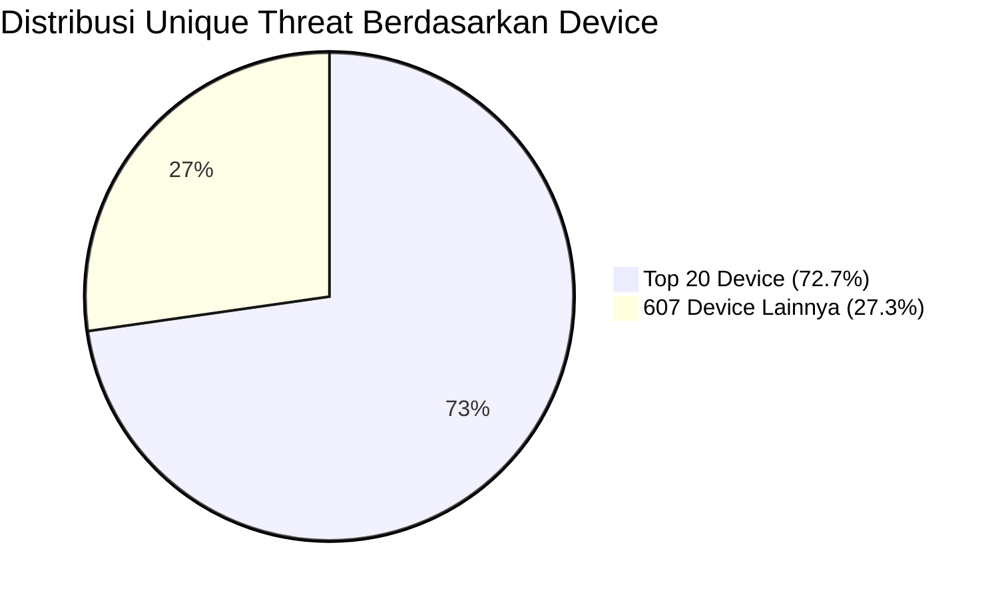

## **Perhitungan Distribusi Threat by Device Model**

### **1. Data Utama**

* **Total unique threat (device terdeteksi):** `6.723`
* **Total unique model device:** `627`
* **Unique threat dari Top 20 device:** `4.890`
* **Unique threat dari 607 device lainnya:** `6.723 - 4.890 = 1.833`

---

### **2. Persentase Threat**

$$
\text{Persentase Top 20 device} = \frac{4.890}{6.723} \times 100\% = 72,7\%
$$

$$
\text{Persentase 607 device lainnya} = \frac{1.833}{6.723} \times 100\% = 27,3\%
$$

---

### **3. Persentase Model Device**

$$
\text{Proporsi Top 20 model} = \frac{20}{627} \times 100\% = 3,2\%
$$

$$
\text{Proporsi 607 model lainnya} = \frac{607}{627} \times 100\% = 96,8\%
$$

---

### **4. Rekap Tabel**

| Kategori               | Jumlah Model | Proporsi Model | Unique Threat | Proporsi Threat |
| ---------------------- | ------------ | -------------- | ------------- | --------------- |
| **Top 20 Device**      | 20           | 3,2%           | 4.890         | 72,7%           |
| **607 Device Lainnya** | 607          | 96,8%          | 1.833         | 27,3%           |
| **Total**              | 627          | 100%           | 6.723         | 100%            |

---

### **5. Diagram Mermaid**

---

### **Penjelasan Singkat**

* **Hanya 3,2% dari seluruh model device (Top 20) bertanggung jawab atas 72,7% dari seluruh kasus unique threat.**
* **Sebaliknya, 96,8% model device (607 tipe) hanya menyumbang 27,3% kasus threat.**
* **Ini menunjukkan konsentrasi risiko yang sangat tinggi pada segelintir tipe device, sehingga mitigasi dapat difokuskan pada Top 20 untuk efisiensi dan dampak maksimal.**

---
