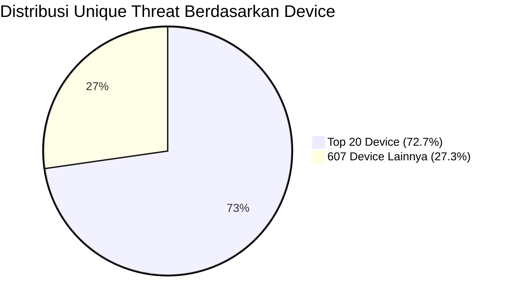

## **Perhitungan Distribusi Threat by Device Model**

### **1. Data Utama**

* **Total unique threat (device terdeteksi):** `6.723`
* **Total unique model device:** `627`
* **Unique threat dari Top 20 device:** `4.890`
* **Unique threat dari 607 device lainnya:** `6.723 - 4.890 = 1.833`

---

### **2. Persentase Threat**

$$
\text{Persentase Top 20 device} = \frac{4.890}{6.723} \times 100\% = 72,7\%
$$

$$
\text{Persentase 607 device lainnya} = \frac{1.833}{6.723} \times 100\% = 27,3\%
$$

---

### **3. Persentase Model Device**

$$
\text{Proporsi Top 20 model} = \frac{20}{627} \times 100\% = 3,2\%
$$

$$
\text{Proporsi 607 model lainnya} = \frac{607}{627} \times 100\% = 96,8\%
$$

---

### **4. Rekap Tabel**

| Kategori               | Jumlah Model | Proporsi Model | Unique Threat | Proporsi Threat |
| ---------------------- | ------------ | -------------- | ------------- | --------------- |
| **Top 20 Device**      | 20           | 3,2%           | 4.890         | 72,7%           |
| **607 Device Lainnya** | 607          | 96,8%          | 1.833         | 27,3%           |
| **Total**              | 627          | 100%           | 6.723         | 100%            |

---

### **5. Diagram Mermaid**



---

### **Penjelasan Singkat**

* **Hanya 3,2% dari seluruh model device (Top 20) bertanggung jawab atas 72,7% dari seluruh kasus unique threat.**
* **Sebaliknya, 96,8% model device (607 tipe) hanya menyumbang 27,3% kasus threat.**
* **Ini menunjukkan konsentrasi risiko yang sangat tinggi pada segelintir tipe device, sehingga mitigasi dapat difokuskan pada Top 20 untuk efisiensi dan dampak maksimal.**

---
# Risk Acceptance Criteria (RAC) – Pencegahan Fraud Ganti Device & RASP Hardware
## Aplikasi Wondr by BNI

---

### Latar Belakang

Kebijakan keamanan aplikasi Wondr by BNI mengintegrasikan dua lapisan kontrol utama untuk memitigasi risiko fraud:
1. **Monitoring frekuensi ganti device** (perpindahan device tidak wajar dalam waktu singkat).
2. **Deteksi dan blokir device berisiko tinggi** menggunakan RASP Hardware (berdasarkan Top 20 device dan flag kritikal).

---

### Risk Acceptance Criteria

| Skenario                                              | Tingkat Risiko     | Kebijakan / Policy                                        | Monitoring                |
|-------------------------------------------------------|--------------------|-----------------------------------------------------------|---------------------------|
| Tidak ganti device                                   | Acceptable         | Lanjut proses (onboarding/transaksi diizinkan)            | Monitor                   |
| Ganti device ≤2x/24 jam & device lolos RASP           | Acceptable         | Lanjut onboarding/transaksi                               | Monitor                   |
| Ganti device ≤2x/24 jam & device high risk (Top 20)   | Unacceptable       | Block onboarding/akses, appeal hanya via manual whitelist | Audit intensif            |
| Ganti device >2x/24 jam                               | Unacceptable       | Block onboarding/akses, audit trail                       | Audit intensif            |
| Ganti device ≤2x/24 jam, device non-risk, ada anomali | Conditionally Acceptable | Allow onboarding, backend alert                         | Monitor lanjut            |

---

### Skenario & Flow Visual

#### Flowchart Integrasi Kebijakan

```mermaid
flowchart TD
    A[User mulai onboarding / login / transaksi]
    A --> B{Apakah device berbeda\ndari sebelumnya?}
    B -- Tidak --> G[Lanjut proses<br/>(onboarding/transaksi diizinkan)]
    B -- Ya --> C[Update counter jumlah<br/>ganti device (24 jam)]
    C --> D{Ganti device<br/>> 2x dalam 24 jam?}
    D -- Ya --> H[Block akses/transaksi<br/>(SP_Intercept = 1, Decline)]
    D -- Tidak --> E[RASP Hardware Attestation]
    E --> F{Device masuk Top 20 Risk<br/>atau kena flag kritikal?}
    F -- Ya --> I[Block onboarding / akses<br/>Tampilkan pesan blokir]
    F -- Tidak --> J{Ada anomali lain?<br/>(geo, pattern, dsb.)}
    J -- Ya --> K[Allow onboarding,<br/>backend alert/monitor lanjut]
    J -- Tidak --> L[Lanjut proses<br/>(onboarding/transaksi diizinkan)]

