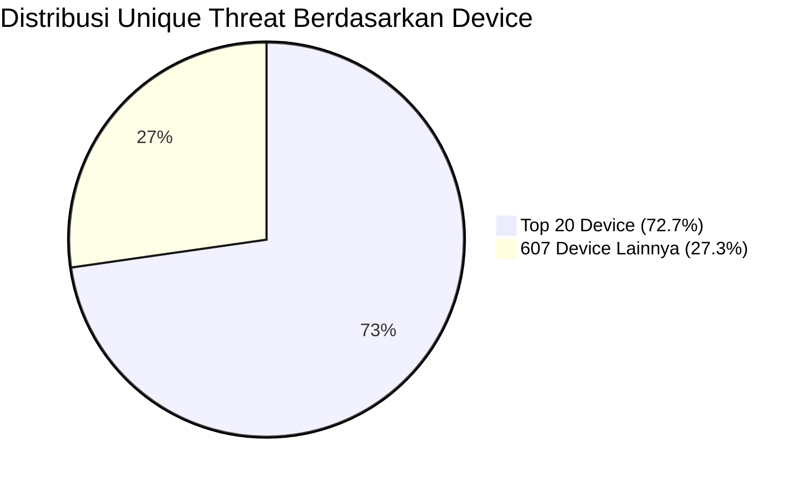

## **Perhitungan Distribusi Threat by Device Model**

### **1. Data Utama**

* **Total unique threat (device terdeteksi):** `6.723`
* **Total unique model device:** `627`
* **Unique threat dari Top 20 device:** `4.890`
* **Unique threat dari 607 device lainnya:** `6.723 - 4.890 = 1.833`

---

### **2. Persentase Threat**

$$
\text{Persentase Top 20 device} = \frac{4.890}{6.723} \times 100\% = 72,7\%
$$

$$
\text{Persentase 607 device lainnya} = \frac{1.833}{6.723} \times 100\% = 27,3\%
$$

---

### **3. Persentase Model Device**

$$
\text{Proporsi Top 20 model} = \frac{20}{627} \times 100\% = 3,2\%
$$

$$
\text{Proporsi 607 model lainnya} = \frac{607}{627} \times 100\% = 96,8\%
$$

---

### **4. Rekap Tabel**

| Kategori               | Jumlah Model | Proporsi Model | Unique Threat | Proporsi Threat |
| ---------------------- | ------------ | -------------- | ------------- | --------------- |
| **Top 20 Device**      | 20           | 3,2%           | 4.890         | 72,7%           |
| **607 Device Lainnya** | 607          | 96,8%          | 1.833         | 27,3%           |
| **Total**              | 627          | 100%           | 6.723         | 100%            |

---

### **5. Diagram Mermaid**



---

### **Penjelasan Singkat**

* **Hanya 3,2% dari seluruh model device (Top 20) bertanggung jawab atas 72,7% dari seluruh kasus unique threat.**
* **Sebaliknya, 96,8% model device (607 tipe) hanya menyumbang 27,3% kasus threat.**
* **Ini menunjukkan konsentrasi risiko yang sangat tinggi pada segelintir tipe device, sehingga mitigasi dapat difokuskan pada Top 20 untuk efisiensi dan dampak maksimal.**

---

# Risk Acceptance Criteria (RAC) Berdasarkan Top 20 Device

## Pencegahan Fraud Ganti Device & RASP Hardware

### Aplikasi Wondr by BNI

---

## 1. Latar Belakang

Implementasi keamanan aplikasi Wondr by BNI menggunakan dua lapis mitigasi utama:

* **Pengendalian perilaku ganti device** (frekuensi pergantian perangkat sebagai indikator risk/fraud).
* **Deteksi dan blokir device berisiko tinggi** menggunakan RASP Hardware (berbasis data Top 20 device/flag kritikal).

---

## 2. Risk Acceptance Table

| Skenario                                              | Tingkat Risiko           | Kebijakan / Policy                                    | Monitoring     |
| ----------------------------------------------------- | ------------------------ | ----------------------------------------------------- | -------------- |
| Tidak ganti device                                    | Acceptable               | Lanjut onboarding/transaksi                           | Monitor        |
| Ganti device ≤2x/24 jam & device lolos RASP           | Acceptable               | Lanjut onboarding/transaksi                           | Monitor        |
| Ganti device ≤2x/24 jam & device high risk (Top 20)   | Unacceptable             | Block onboarding/akses, appeal hanya manual whitelist | Audit intensif |
| Ganti device >2x/24 jam                               | Unacceptable             | Block onboarding/akses, audit trail                   | Audit intensif |
| Ganti device ≤2x/24 jam, device non-risk, ada anomali | Conditionally Acceptable | Allow onboarding, backend alert                       | Monitor lanjut |

---

## 3. Penjelasan Skenario

* **Tidak ganti device**:
  User lanjut proses tanpa pembatasan khusus.
* **Ganti device ≤2x/24 jam, device aman**:
  User lanjut onboarding/transaksi.
* **Ganti device ≤2x/24 jam, device Top 20/flag risk**:
  User di-block onboarding/akses, hanya bisa appeal via whitelist manual dengan verifikasi ketat.
* **Ganti device >2x/24 jam**:
  User otomatis di-block onboarding/akses, audit trail dicatat.
* **Ganti device ≤2x/24 jam, device non-risk, ada anomali**:
  Proses diperbolehkan, backend melakukan alert dan monitoring lanjut.

---

## 4. Flowchart RAC (Mermaid)

```mermaid
flowchart TD
    A([User mulai onboarding / login / transaksi])
    A --> B{Device sama seperti sebelumnya?}
    B -- Ya --> C[Lanjut proses (diperbolehkan)]
    B -- Tidak --> D[Update counter ganti device (24 jam)]
    D --> E{Ganti device > 2x / 24 jam?}
    E -- Ya --> F[Block akses/transaksi (Decline)]
    E -- Tidak --> G[RASP Hardware Attestation]
    G --> H{Device Top 20 risk / flag kritikal?}
    H -- Ya --> I[Block onboarding/akses\nTampilkan pesan blokir]
    H -- Tidak --> J{Ada anomali lain?}
    J -- Ya --> K[Allow onboarding\nBackend alert/monitor lanjut]
    J -- Tidak --> L[Lanjut proses (diperbolehkan)]
```
---

## 5. Narasi Kebijakan

* **Blokir otomatis** berlaku untuk ganti device yang tidak wajar (>2x/24 jam) atau device high risk (Top 20/flag RASP).
* **User legitimate** tetap bisa akses layanan dengan aman selama perilaku dan device mereka tidak berisiko.
* **Appeal/remediasi** hanya berlaku untuk kasus device legitimate yang diverifikasi manual oleh CS/backend.
* Semua proses tercatat di audit trail untuk investigasi, evaluasi policy, dan kebutuhan compliance.

---

## 6. Rekomendasi

* **Otomasi enforcement dan monitoring** pada backend.
* **SOP appeal** yang ketat dan edukasi user informatif.
* **Update periodik** Top 20 device, flag policy, dan review angka false positive/feedback user.

---
