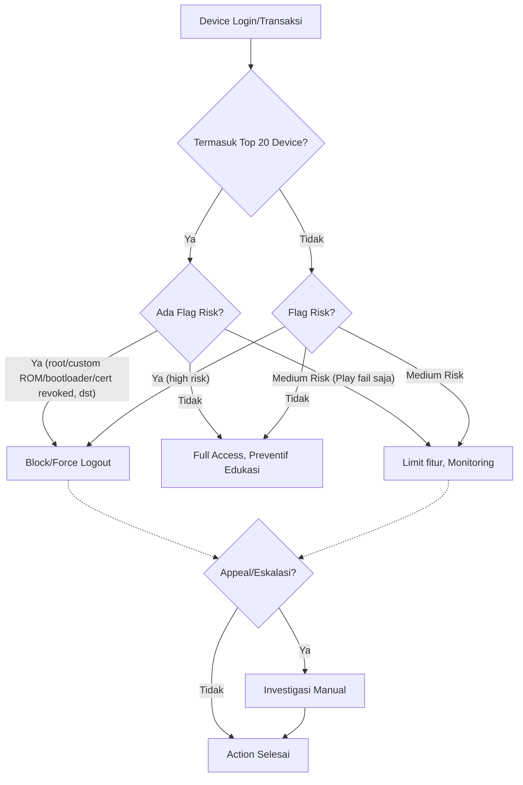
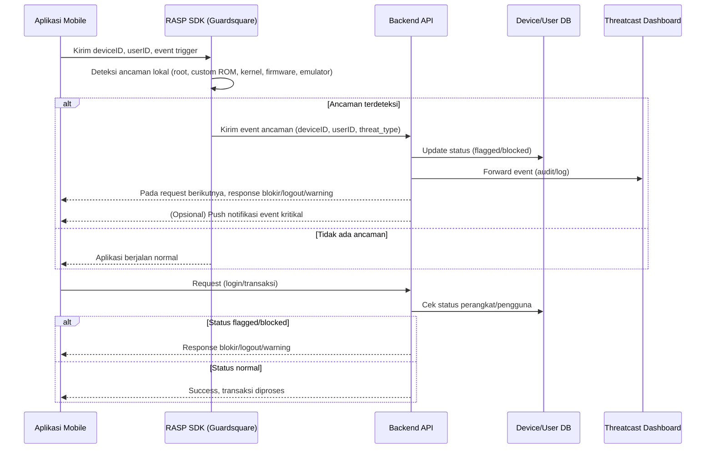

# **Risk Acceptance Criteria (RAC) – Device Risk pada Aplikasi wondr By BNI**

---

## **1. Tujuan**

Dokumen ini digunakan sebagai panduan dan acuan formal dalam proses pengelolaan risiko perangkat (device risk) pada aplikasi wondr By BNI, khususnya terkait perangkat yang terdeteksi memiliki hardware flag risk berdasarkan statistik **Top 20 Mobile Device Type** dari Threatcast.

---

## **2. Prinsip Umum**

* Keputusan risk acceptance diambil **per individu (per device)**, bukan massal per model.
* **Top 20 Device** digunakan sebagai **prioritas monitoring dan investigasi**—bukan dasar blokir massal.
* Action utama didasarkan pada deteksi **hardware flag risk** (root, custom ROM, bootloader unlocked, certificate revoked, dsb).

---

## **3. Data Statistik Top 20 Device dari Threatcast**

| No | Model Device       | Bootloader Unlocked | Certificate Revoked | Cert Invalid | Root Cert Not Google/AOSP | Grand Total |
| -- | ------------------ | ------------------- | ------------------- | ------------ | ------------------------- | ----------- |
| 1  | Vivo vivo 1906     | 1                   | 4511                | -            | -                         | 4512        |
| 2  | Infinix HOT 9 Play | 4386                | -                   | -            | -                         | 4386        |
| 3  | Infinix HOT 10     | 3185                | -                   | -            | -                         | 3185        |
| 4  | Vivo vivo 1920     | 1                   | 2803                | -            | -                         | 2804        |
| 5  | Infinix NOTE 8     | -                   | 1946                | -            | -                         | 1946        |
| 6  | Samsung Galaxy A03 | 11                  | 1669                | -            | 15                        | 1695        |
| 7  | Vivo vivo 1819     | 4                   | 1638                | -            | -                         | 1642        |
| 8  | Vivo vivo 1724     | 12                  | 1361                | -            | -                         | 1373        |
| 9  | Oppo CPH2015       | 1365                | 1                   | -            | -                         | 1366        |
| 10 | PD1901::VIVO Y17   | 1326                | -                   | -            | -                         | 1326        |
| 11 | Vivo vivo Y22      | -                   | 1279                | -            | -                         | 1279        |
| 12 | Vivo Y16           | -                   | 1075                | -            | -                         | 1075        |
| 13 | Infinix HOT 9      | -                   | 985                 | -            | -                         | 985         |
| 14 | Redmi Note 7       | 672                 | 93                  | -            | 28                        | 811         |
| 15 | Vivo V2120         | -                   | 782                 | -            | -                         | 782         |
| 16 | Infinix HOT Play   | 7                   | 771                 | -            | -                         | 778         |
| 17 | Vivo Y17s          | -                   | 620                 | -            | -                         | 620         |
| 18 | Vivo V2039         | -                   | 597                 | -            | -                         | 597         |
| 19 | Infinix NOTE 7     | -                   | 594                 | -            | -                         | 594         |
| 20 | Xiaomi Redmi 6A    | -                   | 591                 | -            | -                         | 591         |

---

## **4. Definisi Risiko dan Hardware Flag**

| Istilah                       | Definisi                                                                                 |
| ----------------------------- | ---------------------------------------------------------------------------------------- |
| Root aktif                    | Device menjalankan Magisk, KernelSU, dsb. (akses root penuh)                             |
| Custom ROM/Non-genuine fw     | Sistem operasi/firmware modifikasi atau tidak resmi                                      |
| Bootloader unlocked           | Bootloader device terbuka, rentan modifikasi OS                                          |
| Certificate revoked/invalid   | Sertifikat digital firmware dicabut/tidak valid                                          |
| Root certificate tidak Google | Sertifikat akar bukan Google/Android, umumnya di custom ROM/AOSP                         |
| Play Integrity/SafetyNet fail | Device gagal verifikasi integritas Google/Android                                        |
| Top 20 Device                 | Dua puluh device dengan insiden flag risk terbanyak (berdasarkan data manual Threatcast) |

---

## **5. Risk Acceptance Criteria & Tindakan**

| Model Device/Type     | Jenis Flag pada Device          | Status Risk    | Action Otomatis     | Komunikasi User     | Catatan Monitoring    |
| --------------------- | ------------------------------- | -------------- | ------------------- | ------------------- | --------------------- |
| **Top 20 Device**     | Root/Custom ROM/Bootloader/CERT | Unacceptable   | Block/force logout  | Notifikasi, edukasi | Prioritas investigasi |
| **Top 20 Device**     | Play Integrity fail saja        | Medium/Monitor | Limit fitur/monitor | Warning edukasi     | Catat tren device     |
| **Top 20 Device**     | Tidak ada flag                  | Accepted       | Full access         | Preventif/edukasi   | Monitoring            |
| **Non-Top 20 Device** | High risk flag                  | Unacceptable   | Block/force logout  | Notifikasi, edukasi | Ikuti RAC umum        |
| **Non-Top 20 Device** | Medium risk flag                | Medium/Monitor | Limit fitur/monitor | Warning edukasi     | Monitoring            |
| **Semua device**      | Tidak ada flag                  | Accepted       | Full access         | -                   | Monitoring            |

---

## **6. Visual Decision Flow**

---

## **7. Monitoring, Review & Appeal**

* **Statistik Top 20 device** diperbaharui secara manual tiap bulan dari Threatcast.
* **Semua action** dicatat di log untuk audit.
* **User yang device-nya diblokir dapat appeal** ke helpdesk/bank untuk investigasi manual.
* **Policy dan threshold direview berkala** oleh IT Risk/FDS.

---

## **8. Catatan Sumber Data & Keterbatasan**

* **Data Top 20 Device diambil dari Threatcast secara manual** (belum terintegrasi dengan aplikasi/FDS).
* **Flag risk tidak tersedia di sistem aplikasi**, hanya pada Threatcast dashboard.
* **Daftar Top 20 bisa berubah sewaktu-waktu** berdasarkan tren terbaru.
* Rekomendasi: **Percepat integrasi Threatcast dan FDS** untuk proses otomatis dan lebih akurat.

---

## **9. Penutup**

RAC ini menjadi acuan utama dalam pengelolaan device risk di aplikasi wondr by BNI, baik untuk tim operasional, audit, maupun regulator.
Kebijakan ini memastikan keamanan tetap optimal tanpa mengorbankan fairness bagi pengguna, dengan monitoring proaktif terhadap device-device berisiko tertinggi.

# **ROOT CAUSE ANALYSIS (RCA) – Pengelolaan Device Risk pada Aplikasi Mobile Banking**

---

## **1. Latar Belakang**

Perangkat mobile yang digunakan nasabah berperan penting dalam keamanan aplikasi mobile banking. Ancaman seperti root, custom ROM, bootloader unlocked, dan masalah sertifikat digital (certificate chain revoked/invalid) terbukti meningkatkan risiko fraud, bypass, dan kompromi data.
Bank telah menerapkan monitoring menggunakan dashboard Threatcast dan RAC (Risk Acceptance Criteria), namun masih ditemukan sejumlah kendala dalam proses deteksi dan mitigasi device risk.

---

## **2. Ringkasan Permasalahan**

### **A. Integrasi Data Flag Risiko**

* **Dashboard Threatcast** telah menyediakan data deteksi hardware flag (root, custom ROM, bootloader unlocked, cert revoked, dsb.) pada perangkat user.
* Namun, **sistem aplikasi dan FDS belum terintegrasi langsung dengan Threatcast**, sehingga tidak ada pertukaran data flag risk secara otomatis.
* **Data Top 20 Device dengan insiden tertinggi masih diperoleh secara manual** dari Threatcast untuk dijadikan prioritas monitoring dan penetapan RAC.

### **B. Ketersediaan Data di Sistem Aplikasi**

* **Data jenis/model device tersedia di sistem aplikasi** dan dapat diakses untuk audit/investigasi.
* **Data hardware flag tidak tersedia di sistem aplikasi**; hanya dapat diakses via Threatcast secara manual.
* Hal ini menyebabkan **ketidakmampuan aplikasi untuk melakukan verifikasi/penindakan flag risk device secara real-time atau otomatis**.

### **C. Implementasi Risk Acceptance Criteria (RAC)**

* RAC yang digunakan sudah baik, yakni berbasis penilaian individu per device, bukan massal per model.
* **Prioritas diberikan pada Top 20 Device**—device yang paling sering terdeteksi flag risk menurut Threatcast.
* **Action otomatis (block/force logout) hanya diberikan pada device yang flagged risk**, tidak semua device dengan model yang sama.
* Pengambilan keputusan terkait risk acceptance berbasis flag risk tetap **mengacu pada data manual Threatcast**.

### **D. Implikasi dan Risiko Residual**

* **Potensi delay dalam deteksi dan penindakan** device risk karena keterbatasan data real-time.
* **Kesulitan dalam melakukan audit/perbandingan antara data device aplikasi dan flag risk**, khususnya pada kasus dispute/appeal dari user.
* **Monitoring dan updating Top 20 Device harus dilakukan manual**, sehingga respons terhadap tren risk bisa tertunda.

---

## **3. Analisa Akar Masalah (Root Cause Analysis)**

| No | Faktor Penyebab Utama                                      | Penjelasan                                                                                                              |
| -- | ---------------------------------------------------------- | ----------------------------------------------------------------------------------------------------------------------- |
| 1  | **Kurangnya Integrasi Data**                               | Data hardware flag risk (root, dsb.) hanya di Threatcast, tidak tersedia di sistem aplikasi/FDS secara otomatis.        |
| 2  | **Proses Manual Pengambilan Data Top 20 Device**           | Monitoring dan updating Top 20 Device dilakukan manual, meningkatkan risiko keterlambatan respon dan human error.       |
| 3  | **Ketergantungan pada Threatcast untuk Deteksi Flag Risk** | Tidak ada sumber data flag risk lain yang bisa diandalkan aplikasi secara otomatis.                                     |
| 4  | **Absennya Feedback Loop Otomatis**                        | Tidak ada umpan balik dua arah antara aplikasi/FDS dengan Threatcast, sehingga risk management tidak adaptif real-time. |

---

## **4. Rekomendasi Perbaikan**

1. **Integrasi Otomatis Data Threatcast ke Sistem Aplikasi/FDS**

   * Kembangkan API atau mekanisme sinkronisasi real-time sehingga data hardware flag bisa diakses dan diolah langsung oleh FDS untuk action otomatis.
2. **Otomasi Updating Top 20 Device**

   * Buat pipeline otomatis untuk updating dan monitoring Top 20 Device berisiko tertinggi.
3. **Penguatan Logging & Audit Trail**

   * Pastikan setiap aksi (block/limit/allow) dan keputusan berbasis RAC tercatat detail untuk kebutuhan audit dan compliance.
4. **Review & Update Policy Secara Berkala**

   * Jadwalkan review bulanan/kuartalan pada list Top 20 Device dan parameter RAC sesuai tren threat intelligence terbaru.
5. **Prosedur Eskalasi & Appeal User**

   * Sediakan jalur appeal dan SOP investigasi manual jika user mengklaim device mereka terkena false positive.

---

## **5. Kesimpulan dan Tindak Lanjut**

Pengelolaan device risk pada aplikasi mobile banking saat ini sudah memiliki fondasi yang baik (berbasis RAC per individu), namun **masih terkendala oleh keterbatasan integrasi data antara Threatcast dan aplikasi/FDS**.
**Solusi utama adalah membangun integrasi data otomatis dan memperkuat proses review, audit, serta appeal,** agar risk management device lebih proaktif, efisien, dan akuntabel.

---

# Rekomendasi Arsitektur Keamanan Mobile Banking

**Integrasi Dua Arah Threatcast dengan Enforcement Otomatis**

---

## 📄 Ringkasan Eksekutif

Aplikasi mobile banking menghadapi tantangan besar terkait keamanan perangkat, khususnya pada platform Android. Berbagai teknik bypass root, modifikasi perangkat, dan custom ROM dapat mengancam keamanan dan meningkatkan risiko fraud. Saat ini, solusi monitoring seperti Guardsquare Threatcast cenderung bersifat satu arah—hanya memantau tanpa enforcement otomatis yang terintegrasi dengan backend aplikasi.
Dokumen ini merekomendasikan arsitektur keamanan dua arah, di mana aplikasi, RASP, backend, dan Threatcast saling terhubung serta mampu menanggulangi ancaman secara otomatis, persisten, dan auditable.

---

## 🔎 Latar Belakang & Permasalahan

### **Permasalahan yang Ditemukan**

* **Monitoring Satu Arah (One-Way Monitoring):**
  Aplikasi hanya mengirimkan data perangkat dan event keamanan ke RASP serta Threatcast untuk monitoring. Tidak ada tindakan aktif atau intervensi otomatis dari backend, kecuali pada kasus khusus.

* **Flag Risiko Tidak Konsisten dan Tidak Persisten:**
  Ancaman seperti penggunaan **custom ROM, kernel tidak resmi, atau firmware termodifikasi** hanya tercatat sebagai log pada Threatcast, tanpa penandaan status perangkat atau pengguna secara permanen di database backend.
  Untuk perangkat dengan **Magisk** (root framework), aplikasi telah diprogram untuk **langsung melakukan crash (force close)** saat deteksi Magisk aktif, sehingga enforcement berjalan instan.
  Namun, untuk perangkat dengan **custom ROM atau kernel modifikasi**, aplikasi tetap berjalan normal walaupun perangkat berisiko—tidak ada pemblokiran otomatis maupun pembatasan fitur.

* **Tidak Ada Feedback Loop atau Enforcement Otomatis untuk Custom ROM dan Kernel Modifikasi:**
  Pengguna pada perangkat dengan custom ROM, firmware tidak asli, atau kernel termodifikasi tetap dapat mengakses fitur aplikasi, karena **tidak ada enforcement otomatis dari backend**.
  **Feedback loop dan enforcement hanya efektif pada kasus root Magisk**, sedangkan untuk custom ROM atau ancaman lain, sistem hanya mencatat log tanpa tindakan nyata.

---

### **Risiko yang Dihadapi**

* Penyerang dapat mengelabui sistem dengan melakukan reinstall aplikasi atau menggunakan custom ROM/kernel tanpa terdeteksi sebagai ancaman oleh backend.
* Perangkat berisiko tetap dapat mengakses fitur sensitif aplikasi, meningkatkan risiko fraud, pengambilalihan akun, dan kebocoran data.
* Tidak terdapat respon otomatis maupun real-time terhadap ancaman yang muncul selain pada kasus deteksi Magisk.

---

## 🎯 Tujuan & Sasaran

* Menghadirkan pengelolaan risiko perangkat/pengguna yang otomatis dan persisten pada setiap sesi aplikasi.
* Menerapkan arsitektur dua arah, di mana Threatcast tidak hanya menerima event, tetapi juga dapat melakukan enforcement (blokir, limitasi, otentikasi ulang) melalui backend dan aplikasi.
* Menjamin setiap event keamanan dapat memicu remediasi secara real-time, otomatis, dan tercatat untuk audit.

---

## 🏛️ Rekomendasi Arsitektur Keamanan

### **Komponen Utama**

* **Aplikasi Mobile**

  * Integrasi RASP SDK (misal: Guardsquare)
  * Deteksi ancaman lokal (root, custom ROM, emulator, firmware tidak asli)
  * Attestation perangkat (contoh: Play Integrity API)
  * Komunikasi API aman (TLS, certificate pinning)
  * Menerima instruksi keamanan (force logout, blokir, notifikasi) dari backend

* **Backend API**

  * Menerima event keamanan dari app/RASP
  * Menyimpan status risiko perangkat/pengguna secara persisten di database
  * Enforcement otomatis (blokir, limitasi fitur, force logout)
  * Endpoint API untuk update status risiko oleh Threatcast
  * Meneruskan log/event keamanan ke Threatcast untuk audit

* **Threatcast / Sistem Monitoring**

  * Pusat event keamanan, audit log, dan analitik
  * Analis keamanan dapat melakukan flag, blokir, atau trigger tindakan risiko
  * Integrasi API dengan backend untuk enforcement secara real-time

* **Database**

  * Menyimpan status perangkat/pengguna, contoh kolom:

    * `device_id`, `user_id`, `risk_status`, `flag_reason`, `updated_at`

---

## 🔗 Alur Kerja Sistem (Flow dan Mermaid Diagram)

### **Deskripsi Alur Kerja**

1. **Startup/Login Aplikasi:**
   Aplikasi menjalankan RASP SDK untuk deteksi ancaman dan attestation perangkat.
2. **Jika Ancaman Terdeteksi:**
   RASP mengirimkan event ke backend API (berisi device/user/threat type).
3. **Backend Processing:**
   Backend mengupdate status perangkat/pengguna di database (`flagged`, `blocked`), dan log event ke Threatcast.
4. **Enforcement & Feedback:**

   * Setiap request aplikasi, backend cek status perangkat/pengguna.
   * Jika status flagged: backend mengirim response (blokir, force logout, warning) ke aplikasi.
   * Backend dapat mengirim notifikasi real-time untuk event kritikal.
5. **Threatcast sebagai Command Center:**
   Analis atau rule otomatis dapat mengupdate status risiko ke backend via API dan men-trigger enforcement real-time.

---

### **Mermaid Sequence Diagram**

---

## 🛡️ Rekomendasi Implementasi Teknis

### **Backend & Database**

* Tambahkan kolom seperti `risk_status` dan `flag_reason` pada tabel perangkat/pengguna.
* Implementasi endpoint untuk menerima event ancaman serta update/query status risiko.
* Terapkan logic enforcement otomatis jika status perangkat/pengguna berisiko.

### **Aplikasi**

* Tambahkan logic untuk menerima dan memproses instruksi blokir/logout/warning dari backend.
* Dukungan notifikasi real-time (contoh: FCM/APNS).

### **Integrasi Threatcast**

* Threatcast/analyst dapat mengupdate status risiko melalui API ke backend.
* Dashboard Threatcast menampilkan status perangkat/pengguna secara real-time.

### **Otomatisasi & Audit**

* Otomasi pemblokiran/session termination berdasarkan sinyal risiko secara real-time.
* Semua aksi tercatat dalam audit log untuk kebutuhan compliance dan forensik.

---

## ⚙️ Contoh Skema Tabel Perangkat/Pengguna

| device\_id     | user\_id | risk\_status | flag\_reason  | updated\_at         |
| -------------- | -------- | ------------ | ------------- | ------------------- |
| ca6f4e37-98... | 555a7f   | flagged      | root detected | 2025-05-27 10:25:00 |
| f42da7b1-28... | 881c3c   | normal       | -             | 2025-05-27 11:00:00 |
| 69ab8de3-29... | 222ee8   | blocked      | custom ROM    | 2025-05-27 12:15:00 |

---

## 🚀 Manfaat Arsitektur Ini

* **Perlindungan Otomatis:** Perangkat dan pengguna berisiko langsung diblokir atau dibatasi tanpa intervensi manual.
* **Status Risiko Persisten & Dapat Diaudit:** Semua status risiko dan enforcement selalu up-to-date serta tercatat dalam audit log.
* **Respon Real-Time:** Ancaman tidak hanya dimonitor, tetapi langsung direspon secara otomatis.
* **Feedback ke Pengguna:** Pengguna mendapat notifikasi langsung jika perangkat atau sesi aplikasi dianggap berisiko.
* **Pengelolaan Keamanan Terpusat:** Threatcast berfungsi sebagai command center aktif, bukan sekadar dashboard pasif.

---

## 📚 Langkah Lanjut & Referensi

* [ ] Tambahkan kolom status risiko pada skema database perangkat/pengguna.
* [ ] Update backend API untuk penerimaan event dan enforcement risk status.
* [ ] Update aplikasi agar dapat memproses respons keamanan dari backend.
* [ ] Integrasikan Threatcast dengan API backend risk.
* [ ] Simulasikan skenario serangan untuk memastikan otomasi berjalan efektif.

**Referensi:**

* [Guardsquare Threatcast Documentation](https://www.guardsquare.com/)
* [OWASP Mobile Security Project](https://owasp.org/www-project-mobile-security-testing-guide/)
* [Google Play Integrity API](https://developer.android.com/google/play/integrity)

---

