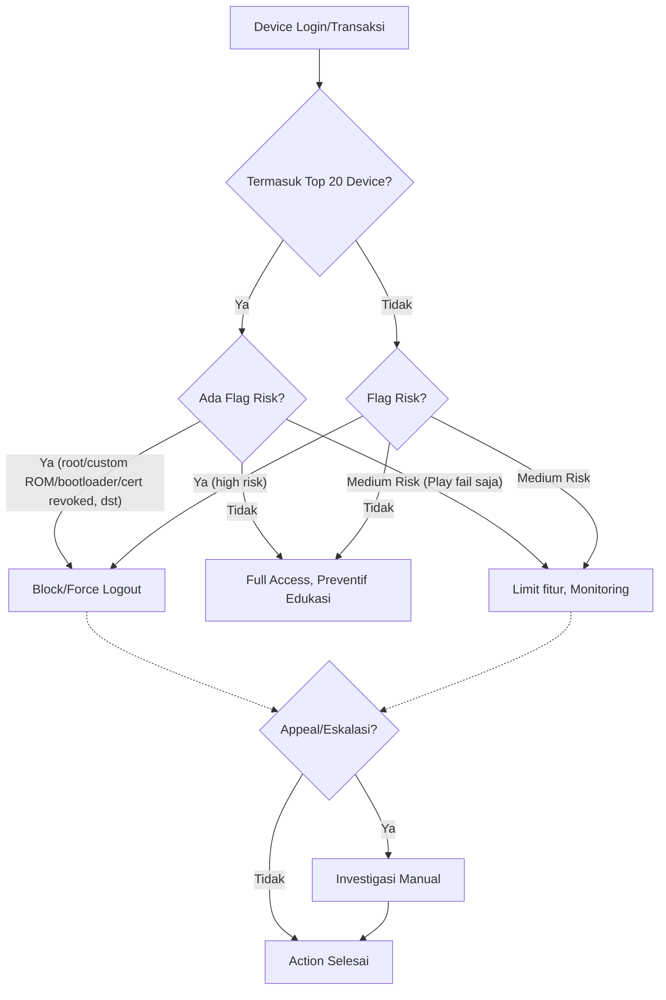

# **Risk Acceptance Criteria (RAC) – Device Risk pada Aplikasi wondr By BNI**

---

## **1. Tujuan**

Dokumen ini digunakan sebagai panduan dan acuan formal dalam proses pengelolaan risiko perangkat (device risk) pada aplikasi wondr By BNI, khususnya terkait perangkat yang terdeteksi memiliki hardware flag risk berdasarkan statistik **Top 20 Mobile Device Type** dari Threatcast.

---

## **2. Prinsip Umum**

* Keputusan risk acceptance diambil **per individu (per device)**, bukan massal per model.
* **Top 20 Device** digunakan sebagai **prioritas monitoring dan investigasi**—bukan dasar blokir massal.
* Action utama didasarkan pada deteksi **hardware flag risk** (root, custom ROM, bootloader unlocked, certificate revoked, dsb).

---

## **3. Data Statistik Top 20 Device dari Threatcast**

| No | Model Device       | Bootloader Unlocked | Certificate Revoked | Cert Invalid | Root Cert Not Google/AOSP | Grand Total |
| -- | ------------------ | ------------------- | ------------------- | ------------ | ------------------------- | ----------- |
| 1  | Vivo vivo 1906     | 1                   | 4511                | -            | -                         | 4512        |
| 2  | Infinix HOT 9 Play | 4386                | -                   | -            | -                         | 4386        |
| 3  | Infinix HOT 10     | 3185                | -                   | -            | -                         | 3185        |
| 4  | Vivo vivo 1920     | 1                   | 2803                | -            | -                         | 2804        |
| 5  | Infinix NOTE 8     | -                   | 1946                | -            | -                         | 1946        |
| 6  | Samsung Galaxy A03 | 11                  | 1669                | -            | 15                        | 1695        |
| 7  | Vivo vivo 1819     | 4                   | 1638                | -            | -                         | 1642        |
| 8  | Vivo vivo 1724     | 12                  | 1361                | -            | -                         | 1373        |
| 9  | Oppo CPH2015       | 1365                | 1                   | -            | -                         | 1366        |
| 10 | PD1901::VIVO Y17   | 1326                | -                   | -            | -                         | 1326        |
| 11 | Vivo vivo Y22      | -                   | 1279                | -            | -                         | 1279        |
| 12 | Vivo Y16           | -                   | 1075                | -            | -                         | 1075        |
| 13 | Infinix HOT 9      | -                   | 985                 | -            | -                         | 985         |
| 14 | Redmi Note 7       | 672                 | 93                  | -            | 28                        | 811         |
| 15 | Vivo V2120         | -                   | 782                 | -            | -                         | 782         |
| 16 | Infinix HOT Play   | 7                   | 771                 | -            | -                         | 778         |
| 17 | Vivo Y17s          | -                   | 620                 | -            | -                         | 620         |
| 18 | Vivo V2039         | -                   | 597                 | -            | -                         | 597         |
| 19 | Infinix NOTE 7     | -                   | 594                 | -            | -                         | 594         |
| 20 | Xiaomi Redmi 6A    | -                   | 591                 | -            | -                         | 591         |

---

## **4. Definisi Risiko dan Hardware Flag**

| Istilah                       | Definisi                                                                                 |
| ----------------------------- | ---------------------------------------------------------------------------------------- |
| Root aktif                    | Device menjalankan Magisk, KernelSU, dsb. (akses root penuh)                             |
| Custom ROM/Non-genuine fw     | Sistem operasi/firmware modifikasi atau tidak resmi                                      |
| Bootloader unlocked           | Bootloader device terbuka, rentan modifikasi OS                                          |
| Certificate revoked/invalid   | Sertifikat digital firmware dicabut/tidak valid                                          |
| Root certificate tidak Google | Sertifikat akar bukan Google/Android, umumnya di custom ROM/AOSP                         |
| Play Integrity/SafetyNet fail | Device gagal verifikasi integritas Google/Android                                        |
| Top 20 Device                 | Dua puluh device dengan insiden flag risk terbanyak (berdasarkan data manual Threatcast) |

---

## **5. Risk Acceptance Criteria & Tindakan**

| Model Device/Type     | Jenis Flag pada Device          | Status Risk    | Action Otomatis     | Komunikasi User     | Catatan Monitoring    |
| --------------------- | ------------------------------- | -------------- | ------------------- | ------------------- | --------------------- |
| **Top 20 Device**     | Root/Custom ROM/Bootloader/CERT | Unacceptable   | Block/force logout  | Notifikasi, edukasi | Prioritas investigasi |
| **Top 20 Device**     | Play Integrity fail saja        | Medium/Monitor | Limit fitur/monitor | Warning edukasi     | Catat tren device     |
| **Top 20 Device**     | Tidak ada flag                  | Accepted       | Full access         | Preventif/edukasi   | Monitoring            |
| **Non-Top 20 Device** | High risk flag                  | Unacceptable   | Block/force logout  | Notifikasi, edukasi | Ikuti RAC umum        |
| **Non-Top 20 Device** | Medium risk flag                | Medium/Monitor | Limit fitur/monitor | Warning edukasi     | Monitoring            |
| **Semua device**      | Tidak ada flag                  | Accepted       | Full access         | -                   | Monitoring            |

---

## **6. Visual Decision Flow**



---

## **7. Monitoring, Review & Appeal**

* **Statistik Top 20 device** diperbaharui secara manual tiap bulan dari Threatcast.
* **Semua action** dicatat di log untuk audit.
* **User yang device-nya diblokir dapat appeal** ke helpdesk/bank untuk investigasi manual.
* **Policy dan threshold direview berkala** oleh IT Risk/FDS.

---

## **8. Catatan Sumber Data & Keterbatasan**

* **Data Top 20 Device diambil dari Threatcast secara manual** (belum terintegrasi dengan aplikasi/FDS).
* **Flag risk tidak tersedia di sistem aplikasi**, hanya pada Threatcast dashboard.
* **Daftar Top 20 bisa berubah sewaktu-waktu** berdasarkan tren terbaru.
* Rekomendasi: **Percepat integrasi Threatcast dan FDS** untuk proses otomatis dan lebih akurat.

---

## **9. Penutup**

RAC ini menjadi acuan utama dalam pengelolaan device risk di aplikasi wondr by BNI, baik untuk tim operasional, audit, maupun regulator.
Kebijakan ini memastikan keamanan tetap optimal tanpa mengorbankan fairness bagi pengguna, dengan monitoring proaktif terhadap device-device berisiko tertinggi.


# **ROOT CAUSE ANALYSIS (RCA) – Pengelolaan Device Risk pada Aplikasi Mobile wondr By BNI**

---

## **1. Latar Belakang**

Perangkat mobile yang digunakan nasabah berperan penting dalam keamanan aplikasi mobile wondr By BNI. Ancaman seperti root, custom ROM, bootloader unlocked, dan masalah sertifikat digital (certificate chain revoked/invalid) terbukti meningkatkan risiko fraud, bypass, dan kompromi data.
Bank telah menerapkan monitoring menggunakan dashboard Threatcast dan RAC (Risk Acceptance Criteria), namun masih ditemukan sejumlah kendala dalam proses deteksi dan mitigasi device risk.

---

## **2. Ringkasan Permasalahan**

### **A. Integrasi Data Flag Risiko**

* **Dashboard Threatcast** telah menyediakan data deteksi hardware flag (root, custom ROM, bootloader unlocked, cert revoked, dsb.) pada perangkat user.
* Namun, **sistem aplikasi dan FDS belum terintegrasi langsung dengan Threatcast**, sehingga tidak ada pertukaran data flag risk secara otomatis.
* **Data Top 20 Device dengan insiden tertinggi masih diperoleh secara manual** dari Threatcast untuk dijadikan prioritas monitoring dan penetapan RAC.

### **B. Ketersediaan Data di Sistem Aplikasi**

* **Data jenis/model device tersedia di sistem aplikasi** dan dapat diakses untuk audit/investigasi.
* **Data hardware flag tidak tersedia di sistem aplikasi**; hanya dapat diakses via Threatcast secara manual.
* Hal ini menyebabkan **ketidakmampuan aplikasi untuk melakukan verifikasi/penindakan flag risk device secara real-time atau otomatis**.

### **C. Implementasi Risk Acceptance Criteria (RAC)**

* **Prioritas diberikan pada Top 20 Device**—device yang paling sering terdeteksi flag risk menurut Threatcast.
* **Action otomatis (block/force logout) hanya diberikan pada device yang flagged risk**, tidak semua device dengan model yang sama.
* Pengambilan keputusan terkait risk acceptance berbasis flag risk tetap **mengacu pada data manual Threatcast**.

### **D. Implikasi dan Risiko Residual**

* **Potensi delay dalam deteksi dan penindakan** device risk karena keterbatasan data real-time.
* **Kesulitan dalam melakukan audit/perbandingan antara data device aplikasi dan flag risk**, khususnya pada kasus dispute/appeal dari user.
* **Monitoring dan updating Top 20 Device harus dilakukan manual**, sehingga respons terhadap tren risk bisa tertunda.

---

## **3. Analisa Akar Masalah (Root Cause Analysis)**

| No | Faktor Penyebab Utama                                      | Penjelasan                                                                                                              |
| -- | ---------------------------------------------------------- | ----------------------------------------------------------------------------------------------------------------------- |
| 1  | **Kurangnya Integrasi Data**                               | Data hardware flag risk (root, dsb.) hanya di Threatcast, tidak tersedia di sistem aplikasi/FDS secara otomatis.        |
| 2  | **Proses Manual Pengambilan Data Top 20 Device**           | Monitoring dan updating Top 20 Device dilakukan manual, meningkatkan risiko keterlambatan respon dan human error.       |
| 3  | **Ketergantungan pada Threatcast untuk Deteksi Flag Risk** | Tidak ada sumber data flag risk lain yang bisa diandalkan aplikasi secara otomatis.                                     |
| 4  | **Absennya Feedback Loop Otomatis**                        | Tidak ada umpan balik dua arah antara aplikasi/FDS dengan Threatcast, sehingga risk management tidak adaptif real-time. |

---

## **4. Rekomendasi Perbaikan**

1. **Integrasi Otomatis Data Threatcast ke Sistem Aplikasi/FDS**

   * Kembangkan API atau mekanisme sinkronisasi real-time sehingga data hardware flag bisa diakses dan diolah langsung oleh FDS untuk action otomatis.
2. **Otomasi Updating Top 20 Device**

   * Buat pipeline otomatis untuk updating dan monitoring Top 20 Device berisiko tertinggi.
3. **Penguatan Logging & Audit Trail**

   * Pastikan setiap aksi (block/limit/allow) dan keputusan berbasis RAC tercatat detail untuk kebutuhan audit dan compliance.
4. **Review & Update Policy Secara Berkala**

   * Jadwalkan review bulanan/kuartalan pada list Top 20 Device dan parameter RAC sesuai tren threat intelligence terbaru.
5. **Prosedur Eskalasi & Appeal User**

   * Sediakan jalur appeal dan SOP investigasi manual jika user mengklaim device mereka terkena false positive.

---

## **5. Kesimpulan dan Tindak Lanjut**

Pengelolaan device risk pada aplikasi mobile wondr By BNI saat ini sudah memiliki fondasi yang baik (berbasis RAC per individu), namun **masih terkendala oleh keterbatasan integrasi data antara Threatcast dan aplikasi/FDS**.
**Solusi utama adalah membangun integrasi data otomatis dan memperkuat proses review, audit, serta appeal,** agar risk management device lebih proaktif, efisien, dan akuntabel.

---

# Rekomendasi Arsitektur Keamanan Mobile Banking – Integrasi Threatcast dan Backend wondr By BNI

---

## 📄 Ringkasan Eksekutif

Aplikasi mobile banking wondr by BNI menghadapi tantangan signifikan dalam pengelolaan risiko perangkat, terutama di ekosistem Android. Saat ini, monitoring keamanan dilakukan melalui integrasi dengan Guardsquare Threatcast, namun hanya sebatas pengiriman data device\_id dari aplikasi wondr ke Threatcast secara satu arah. Tidak terdapat umpan balik (feedback loop) dari Threatcast ke backend wondr mengenai status flag atau risiko perangkat. Selain itu, device\_id yang digunakan pada aplikasi wondr dan Threatcast adalah hasil generate saat instalasi aplikasi, **bukan hardware ID**, sehingga bisa berubah jika aplikasi dihapus dan dipasang ulang pada perangkat yang sama.

---

## 🔎 Latar Belakang & Permasalahan

### **Permasalahan Utama**

* **UUID/device\_id Konsisten tapi Tidak Persisten Hardware:**
  UUID di Guardsquare (Threatcast) identik dengan device\_id pada backend wondr, sehingga memudahkan cross-check dan integrasi. Namun, ID ini **dibentuk saat aplikasi diinstal**, bukan merepresentasikan perangkat fisik. Jika aplikasi dihapus lalu diinstal ulang, device\_id berubah meski pada device yang sama.
* **Komunikasi Satu Arah (One-Way):**
  Saat ini, aplikasi wondr hanya mengirimkan device\_id beserta event deteksi keamanan ke Threatcast. **Tidak ada umpan balik** atau notifikasi status flag dari Threatcast ke backend wondr.
* **Flag Risiko Tidak Persisten:**
  Status perangkat berisiko (misal: root, custom ROM) hanya tercatat pada Threatcast. Tidak ada sinkronisasi otomatis ke backend atau penyimpanan status risiko secara permanen pada database backend wondr.
* **Enforcement dan Monitoring Manual:**
  Setiap investigasi device berisiko atau user bermasalah memerlukan pengecekan manual ke dashboard Threatcast, tanpa mekanisme otomatis di backend aplikasi.

---

### **Keterbatasan Teknis**

* **Tracking Risiko Tidak Konsisten:**
  Karena device\_id berubah saat reinstall aplikasi, histori risiko tidak bisa melekat pada hardware tertentu secara konsisten.
* **Tidak Ada Enforcement Otomatis:**
  Aksi seperti blokir, logout, atau pembatasan fitur hanya bisa dilakukan secara manual setelah investigasi oleh tim IT Risk/Security.

---

## 🎯 Tujuan & Sasaran

* Meningkatkan integrasi dua arah antara Threatcast dan backend wondr, sehingga status flag risiko bisa diterima secara otomatis di backend.
* Menyimpan status risiko perangkat secara persisten pada database backend untuk mendukung enforcement otomatis dan audit trail.
* Mewujudkan risk management yang proaktif, real-time, dan tidak hanya mengandalkan intervensi manual.

---

Tentu, berikut adalah versi **penyempurnaan laporan** dengan tambahan klarifikasi device\_id/UUID, status API dua arah, edukasi user, dan penjelasan audit trail, tanpa mengubah struktur inti laporan Anda:

---

# Rekomendasi Arsitektur Keamanan Mobile wondr By BNI

**Integrasi Dua Arah Threatcast dengan Enforcement Otomatis**

---

## 📄 Ringkasan Eksekutif

Aplikasi mobile wondr by BNI menghadapi tantangan besar pada keamanan perangkat, khususnya di ekosistem Android. Berbagai teknik bypass root, modifikasi perangkat, dan custom ROM dapat meningkatkan risiko fraud. Saat ini, solusi monitoring seperti Guardsquare Threatcast masih bersifat satu arah—aplikasi hanya mengirim event ke Threatcast, tanpa ada umpan balik otomatis ke backend aplikasi.
Dokumen ini merekomendasikan arsitektur keamanan dua arah, di mana aplikasi, RASP, backend, dan Threatcast saling terhubung dan mampu menanggulangi ancaman secara otomatis, persisten, dan auditable.

---

## 🔎 Latar Belakang & Permasalahan

### **Permasalahan yang Ditemukan**

* **Monitoring Satu Arah (One-Way Monitoring):**
  Aplikasi hanya mengirim data perangkat dan event keamanan ke RASP/Threatcast untuk monitoring. Tidak ada tindakan aktif atau intervensi otomatis dari backend, kecuali kasus khusus (root/Magisk).

* **Flag Risiko Tidak Persisten dan Tidak Konsisten:**
  Ancaman seperti custom ROM, kernel tidak resmi, atau firmware termodifikasi hanya tercatat di Threatcast tanpa penandaan status perangkat di backend aplikasi secara permanen.
  Untuk perangkat dengan Magisk (root), aplikasi langsung crash, namun untuk custom ROM, aplikasi tetap berjalan tanpa enforcement otomatis.

* **Tidak Ada Feedback Loop Otomatis:**
  Enforcement otomatis dari backend hanya dapat terjadi jika ada integrasi API dua arah dengan Threatcast. Saat ini, backend hanya bisa melakukan blokir/aksi setelah pengecekan manual di Threatcast.

---

## 🎯 Tujuan & Sasaran

* Menciptakan pengelolaan risiko perangkat/pengguna yang otomatis dan persisten pada setiap sesi aplikasi.
* Menjamin setiap event keamanan dapat memicu remediasi secara real-time, otomatis, dan tercatat untuk audit serta compliance.
* Memastikan edukasi dan transparansi kepada pengguna yang terkena enforcement.

---

## 🏛️ Rekomendasi Arsitektur Keamanan

### **Komponen Utama**

* **Aplikasi Mobile wondr**

  * Integrasi RASP SDK (Guardsquare) untuk deteksi root, custom ROM, emulator, firmware tidak asli.
  * Attestation perangkat (Play Integrity API).
  * Komunikasi API aman (TLS, certificate pinning).
  * Menerima instruksi keamanan dari backend (blokir, force logout, notifikasi).
  * Notifikasi real-time (FCM/APNS).
  * Edukasi user: Pesan blokir/log out jelas, disertai petunjuk solusi.

* **Backend API**

  * Menerima event keamanan dari aplikasi/RASP.
  * Menyimpan status risiko perangkat/user di database (`device_id`, `user_id`, `risk_status`, `flag_reason`, `updated_at`).
  * Enforcement otomatis sesuai Risk Acceptance Criteria (RAC).
  * Endpoint API untuk sinkronisasi flag risiko dengan Threatcast (dua arah; *saat ini dalam perencanaan/roadmap*).
  * Audit trail seluruh aksi dan update status, minimal disimpan selama 6 bulan untuk keperluan investigasi/regulator.

* **Threatcast (Guardsquare)**

  * Pusat event keamanan, audit log, dan analitik perangkat.
  * API dua arah (ke depan/roadmap) untuk mengirimkan status flag ke backend wondr.
  * Dashboard monitoring dan investigasi manual oleh tim IT Risk/Security.

---

### **Catatan Device\_ID/UUID**

> **Device\_id/UUID yang digunakan di wondr dan Threatcast identik, namun terbentuk pada saat instalasi aplikasi (application-scoped), bukan berbasis hardware. Jika user melakukan reinstall aplikasi, device\_id baru akan terbentuk sehingga tracking risiko tidak persisten terhadap perangkat fisik yang sama.**

---

## 🔗 Alur Kerja Sistem (Flow & Diagram)

### **Narasi Alur**

1. **User install aplikasi wondr**; proses instalasi men-trigger RASP SDK (Guardsquare).
2. **RASP SDK mendeteksi event ancaman** (root, custom ROM, dsb.).
3. **Event RASP otomatis dikirim ke Threatcast Dashboard** sebagai pusat monitoring.
4. **(Ideal, future-proof): Threatcast mengirimkan flag status risiko** (device\_id/UUID flagged) ke backend wondr melalui API dua arah.
5. **Backend memproses flag device\_id/UUID**, mencocokkan dengan database:

   * Jika device\_id/UUID terflag, backend **melakukan blokir, force logout, atau limitasi fitur**.
   * User mendapatkan notifikasi real-time, disertai edukasi dan petunjuk jika devicenya terblokir.

---

### **Mermaid Sequence Diagram – Disesuaikan**
```Mermaid
sequenceDiagram
    participant User as User
    participant App as Aplikasi wondr
    participant RASP as RASP SDK
    participant Threatcast as Threatcast Dashboard
    participant Backend as Backend API

    User->>App: Install aplikasi wondr
    App->>RASP: Trigger RASP SDK\n(generate device_id,\ndeteksi ancaman)
    RASP->>Threatcast: Kirim event & device_id
    RASP->>Backend: Forward event & device_id
    Threatcast->>Backend: Kirim flag status risiko
    Backend->>App: Instruksi blokir/logout/warning\natau allow akses normal
    App->>User: Tampilkan notifikasi\ndevice action/edukasi
```
## ⚠️ Keterbatasan & Implikasi

* **Device\_id Tidak Persisten Hardware:**
  Tidak dapat melakukan tracking risiko secara akurat jika user reinstall aplikasi, karena device\_id baru akan terbentuk.

* **Enforcement Manual (Jika API dua arah belum diterapkan):**
  Backend hanya bisa melakukan blokir/aksi setelah pengecekan manual di Threatcast.

* **Audit Trail Terbatas:**
  Histori status risiko perangkat tidak selalu tersedia di backend kecuali sudah terintegrasi penuh.

* **Edukasi User Penting:**
  Pastikan pesan blokir atau force logout dilengkapi edukasi dan petunjuk bagi user, untuk menghindari kebingungan atau false report ke CS.

---

## 🚀 Manfaat Arsitektur (Jika Integrasi 2 Arah Diterapkan)

* **Enforcement Otomatis:**
  Risiko perangkat dapat langsung diblokir/ditindak tanpa menunggu pengecekan manual.
* **Status Risiko Persisten & Dapat Diaudit:**
  Semua status risiko dan enforcement tercatat di backend.
* **Respon Real-Time:**
  Ancaman langsung mendapat respon tanpa delay manual.
* **Pengelolaan Keamanan Terpusat:**
  Threatcast dan backend saling terintegrasi sebagai command center aktif.

---

## 📚 Rekomendasi & Langkah Lanjut

1. **Bangun integrasi API dua arah** antara Threatcast dan backend wondr, sehingga flag risiko dapat langsung diterima backend.
2. **Evaluasi opsi pembentukan device\_id** berbasis hardware signature (bila privacy dan regulasi memungkinkan), agar risk tracking lebih persisten.
3. **Perkuat audit trail dan compliance** dengan menyimpan histori status risiko di backend minimal 6 bulan.
4. **Sosialisasi keterbatasan** terkait device\_id pada tim audit dan compliance, agar investigasi manual dapat mempertimbangkan aspek ini.
5. **Sediakan template edukasi user** yang jelas apabila device mereka terkena blokir/enforcement.

---

**Referensi:**

* [Guardsquare Threatcast Documentation](https://www.guardsquare.com/products/threatcast)
* [OWASP Mobile Security Testing Guide](https://owasp.org/www-project-mobile-security-testing-guide/)
* [Google Play Integrity API](https://developer.android.com/google/play/integrity)
* [ISO/IEC 27001:2013 – Information Security Management](https://www.iso.org/isoiec-27001-information-security.html)

---
