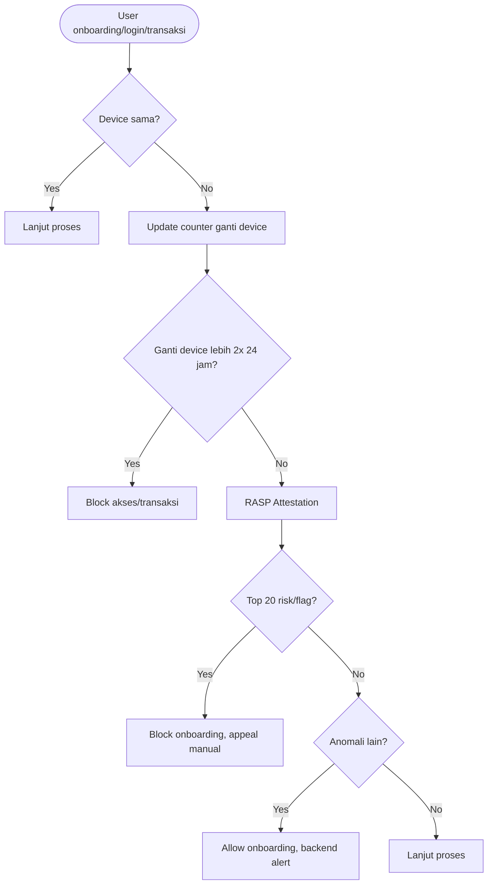

# Risk Acceptance Criteria (RAC) – Pencegahan Fraud Ganti Device & RASP Hardware

**Aplikasi Wondr by BNI**

---

## 1. Tabel Risk Acceptance Criteria

| Skenario                                             | Tingkat Risiko | Penjelasan                                     | Kebijakan / Policy                              | Monitoring/Audit |
| ---------------------------------------------------- | -------------- | ---------------------------------------------- | ----------------------------------------------- | ---------------- |
| Device **tidak ganti**, model bukan Top 20           | Low            | Aman, tidak masuk high risk & tidak anomali    | Lanjut onboarding/transaksi                     | Monitor rutin    |
| Ganti device ≤2x/24 jam, model bukan Top 20          | Low            | Device berganti wajar, model tidak rawan       | Lanjut onboarding/transaksi                     | Monitor rutin    |
| Ganti device ≤2x/24 jam, **model masuk Top 20**      | High           | Model terbukti sering fraud, sesuai Threatcast | Block onboarding/akses, appeal manual whitelist | Audit intensif   |
| Ganti device >2x/24 jam                              | High           | Ganti device berlebihan                        | Block onboarding/akses, audit trail             | Audit intensif   |
| Ganti device ≤2x/24 jam, model bukan Top 20, anomali | Medium         | Device aman, ada pola/geolokasi anomali        | Allow onboarding, backend alert                 | Monitor khusus   |

---

## 2. Penjelasan Alur Langkah

1. **User mulai onboarding, login, atau transaksi.**
2. **Cek apakah device sama seperti sebelumnya:**

   * Jika **tidak ganti device** → proses lanjut (**Acceptable**)
   * Jika **ganti device** → update counter jumlah ganti device (24 jam)
3. **Jika ganti device >2x dalam 24 jam:**

   * **Block akses/transaksi** (**Unacceptable**)
4. **Jika ganti device ≤2x/24 jam:**

   * **Lakukan RASP Hardware Attestation:**

     * Jika **device termasuk Top 20 risk / flag kritikal**:
       **Block onboarding/akses, appeal hanya manual** (**Unacceptable**)
     * Jika **device lolos RASP**:

       * **Cek anomali lain** (geo, pola transaksi, dll):

         * Jika **ada anomali** → allow onboarding + backend alert (**Conditionally Acceptable**)
         * Jika **tidak ada anomali** → allow onboarding (**Acceptable**)

---

## 3. Flow Diagram (Gambar Visual & Mermaid)

## 4. Narasi Kebijakan

* **Blokir otomatis** berlaku untuk perilaku ganti device berlebihan atau device high risk (Top 20/flag RASP).
* **User legitimate** tetap bisa akses aplikasi tanpa hambatan berarti, appeal hanya untuk device valid (manual).
* Semua proses tercatat sebagai audit trail untuk compliance dan investigasi.

---

> **RAC ini menjamin multilayered defense untuk fraud prevention pada onboarding dan akses aplikasi Wondr.**

---
