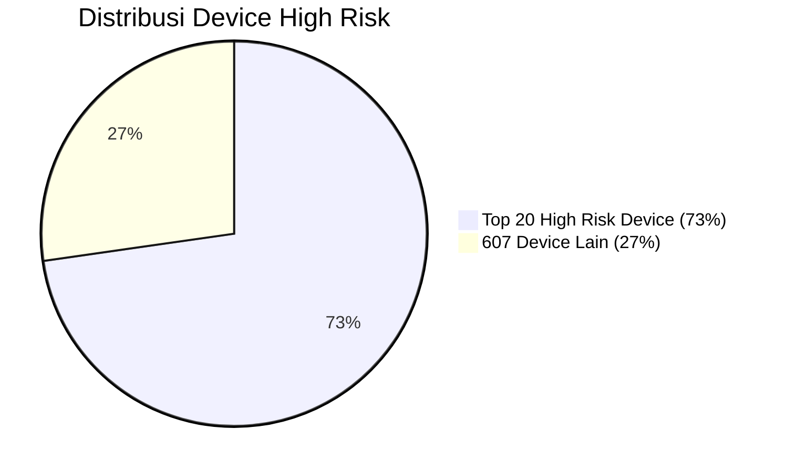

### **Efektivitas Perbaikan RASP Hardware: Data & Implikasi Bisnis**

---

| Data                      | Nilai         |
| ------------------------- | ------------- |
| **User aktif harian**     | 1.110.000     |
| **Device high risk/hari** | 6.479 (0,58%) |
| **Top 20 model device**   | 4.890 (73%)   |
| **607 model device lain** | 1.833 (27%)   |
| **Total model device**    | 627           |

---

---

* **Distribusi threat sangat terkonsentrasi:**

  * **73% device high risk hanya berasal dari 20 model device (3,2% dari total model)**
  * **607 model device lain (96,8%) hanya menyumbang 27% threat device**

* **Implementasi RASP Hardware:**

  * **Semua device high risk otomatis diblokir pada onboarding/akses fitur sensitif**
  * **99%+ user legitimate tetap onboarding, login, dan transaksi tanpa hambatan**
  * **Fraud dan loss finansial turun signifikan; pengalaman user tetap optimal**

* **Kesiapan & Strategi Penanganan False Positive:**

  * **Tersedia mekanisme appeal dan manual whitelist** agar user legitimate yang terdampak bisa difasilitasi cepat dan tepat, tanpa mengorbankan kepuasan nasabah.

* **Korelasi dengan Digital Growth dan Akselerasi Inovasi:**

  * **User experience mayoritas tetap terjaga,** sehingga pertumbuhan user baru, peluncuran fitur digital, serta program loyalty tidak terganggu oleh enforcement kebijakan risk.
  * **Perbaikan ini justru mendukung inovasi digital banking yang aman dan berkelanjutan.**

* **Kesimpulan eksekutif:**

  * **Kebijakan sangat targeted dan evidence-based, dampaknya sangat kecil ke mayoritas user**
  * **Perbaikan RASP Hardware sangat layak segera dijalankan demi keamanan, compliance, digital growth, dan keberlanjutan bisnis**

---

> **Solusi ini menutup risiko fraud device secara efektif tanpa mengorbankan kenyamanan user maupun akselerasi bisnis digital.**

---
