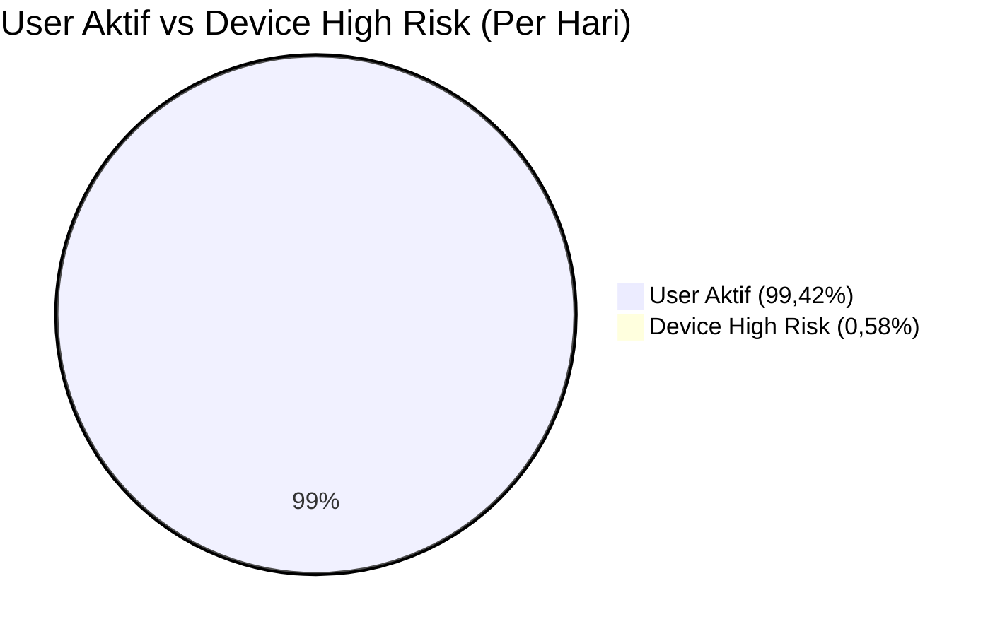
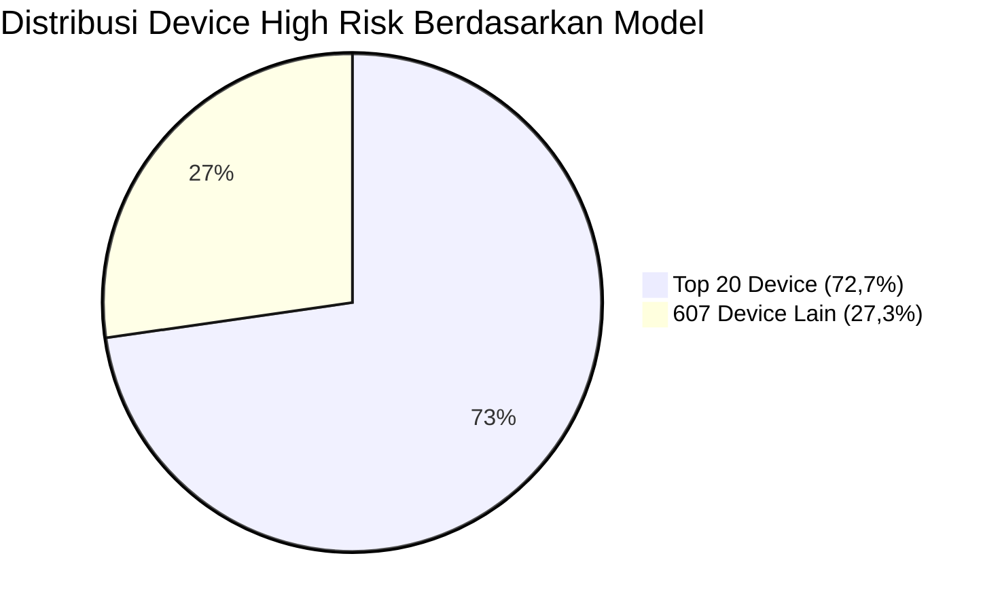

# Laporan Analisa Perbaikan RASP Hardware

Aplikasi Wondr by BNI

---

## 1. Perbandingan Jumlah Active User dan Jumlah Threat

* **User aktif harian aplikasi Wondr:** 1.110.000 user per hari
* **Device high risk (threat) terdeteksi per hari:** 6.479 device
* **Persentase threat:**

  $$
  \frac{6.479}{1.110.000} \times 100\% \approx 0,58\%
  $$
* **Interpretasi:**
  Hanya **0,58% dari seluruh user aktif harian** yang terdeteksi sebagai device high risk (root, custom ROM, dsb).
  Dengan kata lain, **lebih dari 99% user legitimate tidak terdampak** oleh kebijakan enforcement ini.

---

### **Diagram Perbandingan Active User vs Device High Risk**

---

## 2. Distribusi Threat yang Mengkerucut ke Top 20 Device

* **Total device high risk unik selama periode monitoring:** 6.723 device
* **Total model device digunakan user:** 627 model
* **Threat pada Top 20 model device:** 4.890 device (**72,7% dari total threat**)
* **Threat pada 607 model device lain:** 1.833 device (**27,3% dari total threat**)
* **Proporsi model:**

  * **Top 20 model = 3,2% dari total model device**
  * **607 model lainnya = 96,8% dari total model device**

---

### **Diagram Distribusi Threat (Top 20 Device vs Lainnya)**

---

## 3. Kesimpulan Analisa

* **Device high risk sangat kecil dibanding populasi user:**
  Hanya 0,58% dari user aktif harian yang terdeteksi threat.
* **Threat sangat terkonsentrasi pada kelompok kecil device:**
  73% threat hanya dari 20 model device (3,2% dari total model).
* **Implementasi RASP Hardware sangat targeted:**

  * Semua device high risk otomatis diblokir onboarding/akses sensitif
  * 99%+ user legitimate tetap onboarding, login, transaksi tanpa hambatan
  * Fraud dan loss finansial turun signifikan; compliance dan trust meningkat
* **Kebijakan evidence-based, sangat layak segera dijalankan demi keamanan, reputasi, dan pertumbuhan bisnis digital.**

---
