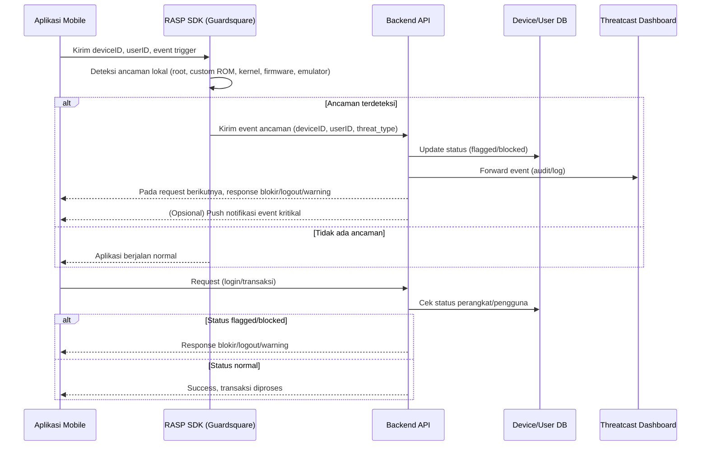

# Rekomendasi Arsitektur Keamanan Mobile Banking

**Integrasi Dua Arah Threatcast dengan Enforcement Otomatis**

---

## 📄 Ringkasan Eksekutif

Aplikasi mobile banking menghadapi tantangan besar terkait keamanan perangkat, khususnya pada platform Android. Berbagai teknik bypass root, modifikasi perangkat, dan custom ROM dapat mengancam keamanan dan meningkatkan risiko fraud. Saat ini, solusi monitoring seperti Guardsquare Threatcast cenderung bersifat satu arah—hanya memantau tanpa enforcement otomatis yang terintegrasi dengan backend aplikasi.
Dokumen ini merekomendasikan arsitektur keamanan dua arah, di mana aplikasi, RASP, backend, dan Threatcast saling terhubung serta mampu menanggulangi ancaman secara otomatis, persisten, dan auditable.

---

## 🔎 Latar Belakang & Permasalahan

### **Permasalahan yang Ditemukan**

* **Monitoring Satu Arah (One-Way Monitoring):**
  Aplikasi hanya mengirimkan data perangkat dan event keamanan ke RASP serta Threatcast untuk monitoring. Tidak ada tindakan aktif atau intervensi otomatis dari backend, kecuali pada kasus khusus.

* **Flag Risiko Tidak Konsisten dan Tidak Persisten:**
  Ancaman seperti penggunaan **custom ROM, kernel tidak resmi, atau firmware termodifikasi** hanya tercatat sebagai log pada Threatcast, tanpa penandaan status perangkat atau pengguna secara permanen di database backend.
  Untuk perangkat dengan **Magisk** (root framework), aplikasi telah diprogram untuk **langsung melakukan crash (force close)** saat deteksi Magisk aktif, sehingga enforcement berjalan instan.
  Namun, untuk perangkat dengan **custom ROM atau kernel modifikasi**, aplikasi tetap berjalan normal walaupun perangkat berisiko—tidak ada pemblokiran otomatis maupun pembatasan fitur.

* **Tidak Ada Feedback Loop atau Enforcement Otomatis untuk Custom ROM dan Kernel Modifikasi:**
  Pengguna pada perangkat dengan custom ROM, firmware tidak asli, atau kernel termodifikasi tetap dapat mengakses fitur aplikasi, karena **tidak ada enforcement otomatis dari backend**.
  **Feedback loop dan enforcement hanya efektif pada kasus root Magisk**, sedangkan untuk custom ROM atau ancaman lain, sistem hanya mencatat log tanpa tindakan nyata.

---

### **Risiko yang Dihadapi**

* Penyerang dapat mengelabui sistem dengan melakukan reinstall aplikasi atau menggunakan custom ROM/kernel tanpa terdeteksi sebagai ancaman oleh backend.
* Perangkat berisiko tetap dapat mengakses fitur sensitif aplikasi, meningkatkan risiko fraud, pengambilalihan akun, dan kebocoran data.
* Tidak terdapat respon otomatis maupun real-time terhadap ancaman yang muncul selain pada kasus deteksi Magisk.

---

## 🎯 Tujuan & Sasaran

* Menghadirkan pengelolaan risiko perangkat/pengguna yang otomatis dan persisten pada setiap sesi aplikasi.
* Menerapkan arsitektur dua arah, di mana Threatcast tidak hanya menerima event, tetapi juga dapat melakukan enforcement (blokir, limitasi, otentikasi ulang) melalui backend dan aplikasi.
* Menjamin setiap event keamanan dapat memicu remediasi secara real-time, otomatis, dan tercatat untuk audit.

---

## 🏛️ Rekomendasi Arsitektur Keamanan

### **Komponen Utama**

* **Aplikasi Mobile**

  * Integrasi RASP SDK (misal: Guardsquare)
  * Deteksi ancaman lokal (root, custom ROM, emulator, firmware tidak asli)
  * Attestation perangkat (contoh: Play Integrity API)
  * Komunikasi API aman (TLS, certificate pinning)
  * Menerima instruksi keamanan (force logout, blokir, notifikasi) dari backend

* **Backend API**

  * Menerima event keamanan dari app/RASP
  * Menyimpan status risiko perangkat/pengguna secara persisten di database
  * Enforcement otomatis (blokir, limitasi fitur, force logout)
  * Endpoint API untuk update status risiko oleh Threatcast
  * Meneruskan log/event keamanan ke Threatcast untuk audit

* **Threatcast / Sistem Monitoring**

  * Pusat event keamanan, audit log, dan analitik
  * Analis keamanan dapat melakukan flag, blokir, atau trigger tindakan risiko
  * Integrasi API dengan backend untuk enforcement secara real-time

* **Database**

  * Menyimpan status perangkat/pengguna, contoh kolom:

    * `device_id`, `user_id`, `risk_status`, `flag_reason`, `updated_at`

---

## 🔗 Alur Kerja Sistem (Flow dan Mermaid Diagram)

### **Deskripsi Alur Kerja**

1. **Startup/Login Aplikasi:**
   Aplikasi menjalankan RASP SDK untuk deteksi ancaman dan attestation perangkat.
2. **Jika Ancaman Terdeteksi:**
   RASP mengirimkan event ke backend API (berisi device/user/threat type).
3. **Backend Processing:**
   Backend mengupdate status perangkat/pengguna di database (`flagged`, `blocked`), dan log event ke Threatcast.
4. **Enforcement & Feedback:**

   * Setiap request aplikasi, backend cek status perangkat/pengguna.
   * Jika status flagged: backend mengirim response (blokir, force logout, warning) ke aplikasi.
   * Backend dapat mengirim notifikasi real-time untuk event kritikal.
5. **Threatcast sebagai Command Center:**
   Analis atau rule otomatis dapat mengupdate status risiko ke backend via API dan men-trigger enforcement real-time.

---

### **Mermaid Sequence Diagram**



---

## 🛡️ Rekomendasi Implementasi Teknis

### **Backend & Database**

* Tambahkan kolom seperti `risk_status` dan `flag_reason` pada tabel perangkat/pengguna.
* Implementasi endpoint untuk menerima event ancaman serta update/query status risiko.
* Terapkan logic enforcement otomatis jika status perangkat/pengguna berisiko.

### **Aplikasi**

* Tambahkan logic untuk menerima dan memproses instruksi blokir/logout/warning dari backend.
* Dukungan notifikasi real-time (contoh: FCM/APNS).

### **Integrasi Threatcast**

* Threatcast/analyst dapat mengupdate status risiko melalui API ke backend.
* Dashboard Threatcast menampilkan status perangkat/pengguna secara real-time.

### **Otomatisasi & Audit**

* Otomasi pemblokiran/session termination berdasarkan sinyal risiko secara real-time.
* Semua aksi tercatat dalam audit log untuk kebutuhan compliance dan forensik.

---

## ⚙️ Contoh Skema Tabel Perangkat/Pengguna

| device\_id     | user\_id | risk\_status | flag\_reason  | updated\_at         |
| -------------- | -------- | ------------ | ------------- | ------------------- |
| ca6f4e37-98... | 555a7f   | flagged      | root detected | 2025-05-27 10:25:00 |
| f42da7b1-28... | 881c3c   | normal       | -             | 2025-05-27 11:00:00 |
| 69ab8de3-29... | 222ee8   | blocked      | custom ROM    | 2025-05-27 12:15:00 |

---

## 🚀 Manfaat Arsitektur Ini

* **Perlindungan Otomatis:** Perangkat dan pengguna berisiko langsung diblokir atau dibatasi tanpa intervensi manual.
* **Status Risiko Persisten & Dapat Diaudit:** Semua status risiko dan enforcement selalu up-to-date serta tercatat dalam audit log.
* **Respon Real-Time:** Ancaman tidak hanya dimonitor, tetapi langsung direspon secara otomatis.
* **Feedback ke Pengguna:** Pengguna mendapat notifikasi langsung jika perangkat atau sesi aplikasi dianggap berisiko.
* **Pengelolaan Keamanan Terpusat:** Threatcast berfungsi sebagai command center aktif, bukan sekadar dashboard pasif.

---

## 📚 Langkah Lanjut & Referensi

* [ ] Tambahkan kolom status risiko pada skema database perangkat/pengguna.
* [ ] Update backend API untuk penerimaan event dan enforcement risk status.
* [ ] Update aplikasi agar dapat memproses respons keamanan dari backend.
* [ ] Integrasikan Threatcast dengan API backend risk.
* [ ] Simulasikan skenario serangan untuk memastikan otomasi berjalan efektif.

**Referensi:**

* [Guardsquare Threatcast Documentation](https://www.guardsquare.com/)
* [OWASP Mobile Security Project](https://owasp.org/www-project-mobile-security-testing-guide/)
* [Google Play Integrity API](https://developer.android.com/google/play/integrity)

---

## Lisensi

```
Copyright (c) 2025

Izin diberikan secara gratis kepada siapa saja yang memperoleh salinan dokumen ini untuk menggunakan, menyalin, memodifikasi, menggabungkan, menerbitkan, mendistribusikan, atau menjual salinan dokumen ini, dengan syarat keterangan hak cipta dan izin ini tetap dicantumkan.
```
